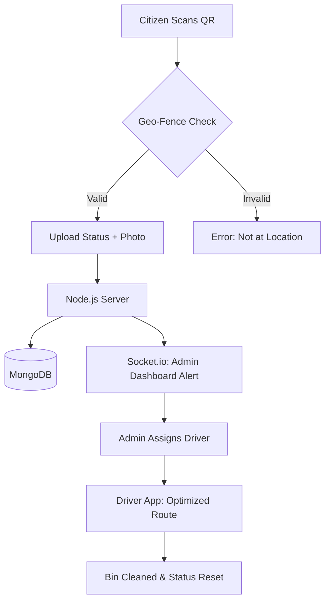

# 🗑️ SwachhPoint: A Decentralized Smart Waste Management System

> **Turning urban waste into actionable data through QR-crowdsourcing and real-time logistics.**

## 📌 Overview

Traditional waste management in India relies on static routes and fixed schedules, leading to overflowing bins and inefficient fuel consumption. **SwachhPoint** digitizes this process. By utilizing **QR-coded "Digital Twins"** of physical dustbins, we empower citizens to report waste levels in real-time, allowing municipal corporations to move from **reactive** to **predictive** cleaning.

## 🚀 Key Features

* **QR-Infrastructure:** Unique identification for every bin; no expensive hardware required.
* **Geo-Fenced Verification:** Custom logic ensures reports are only submitted when the user is within  of the bin's GPS coordinates.
* **Real-time Heatmaps:** Admin dashboard visualizing "Garbage Hotspots" across the city using **Leaflet.js**.
* **Automated Dispatch:** Instant driver notification system for "Full" status bins to optimize collection routes.
* **Gamified Rewards:** "Green Credits" system to incentivize civic participation.

## 🛠 Tech Stack

| Layer | Technology |
| --- | --- |
| **Frontend** | React.js, Tailwind CSS, Leaflet.js |
| **Backend** | Node.js, Express.js, Socket.io (Real-time) |
| **Database** | MongoDB (NoSQL), Firebase Storage |
| **Auth** | JWT (JSON Web Tokens) |
| **APIs** | Geolocation API, react-qr-code |

## 📐 System Architecture



## 💡 How to Run Locally

1. **Clone the repo:**
```bash
git clone https://github.com/yourusername/swachhpoint.git

```


2. **Install Dependencies:**
```bash
npm install && cd client && npm install

```


3. **Setup Environment Variables:**
Create a `.env` file in the root:
```env
MONGO_URI=your_mongodb_uri
JWT_SECRET=your_secret

```


4. **Run the App:**
```bash
npm run dev

```


## 🌍 Impact

* **30% Reduction** in fuel costs for municipal trucks.
* **Zero-Cost Infrastructure:** Leverages existing smartphones instead of costly IoT sensors.
* **Data-Driven Governance:** Identifies peak waste hours per locality.

---

### 🌟 Future Roadmap

* **AI Integration:** Automatic bin-fill level detection using TensorFlow.js.
* **LoRaWAN Sensors:** Low-power sensors for underground/remote bin monitoring.
* **Informal Sector Integration:** A portal for local waste-pickers to claim recyclable "Green Bags."

---

**Developed with ❤️ By Anushka Kashyap


Open complete.html file
for municipal dashboard login : username- officer123 and pass- 1234
for worker login :  username- worker123 and pass - 1234
for citizen login  :  username: citizen123 and pass - 1234
for buyer login  :  username : buyer123  and  pass - 1234
